# TODOs for successful client transition
  + Sign up for [Heroku](https://signup.heroku.com/)
  + Become a collaborator on our current project (need email)
  + Transfer project ownership (went ahead and did this anyhow)
  + Know how to modify/remove Heroku variables **<- We were here last time**
    + [Instructions](#heroku)
  + Get email variables for automated emailing 
    + [Instructions](#emailing-variables)

All of this will cost you:
- $0/month **_for now_**, until database capacity is reached (512MB)
- Prices of current database provider (mLab) then start at $15/month/GB

Enjoy your paperless loan tracking application!

## Scaling Recommendations
- Instructions to move to a bigger database of the current provider can be found [here](https://devcenter.heroku.com/articles/mongolab#changing-plans)
  - Recommended Implementation: Have archived loans as a static JSON/mongodump file in a S3 bucket or similar storage/CDN service. Only retrieve them when searching for them, and modify that file as such. Then accordingly modify 'archived_filter' on *custom-filters.js*, reset loading, add a new Factory ↔ Express interaction, and add/remove loans to active MongoDB on loan 'revival' or death.
    - *Learning opportunity* if no prior experience with these services
- Other possible features:
  - Date filters based on updated_at Date
  - Auto logout due to inactivity or token expiration. Possible looks:
    - Notification-style popup on the lower-right corner with time left
    - Modal style of "MM:SS left [renew token]" etc
  - Auto System comment with Admin name on it (internally referred to as 'notes'):
    - Buyer's Order Changes (admin-only)
    - Warranty Changes (**not** admin-only)
  - More in-depth testing, and done on a mock database

# Autowise Loan Tracking Documentation

## Table of Contents
+ [Summary](#summary)
+ [App Functionality Abridged](#app-functionality-abridged)
    * [Loan Management](#loan-management)
        - [Creating Loans](#creating-loans)
        - [Buyer's Order](#buyers-order)
        - [Modifying Loans](#modifying-loans)
        - [Comments on Loans](#comments-on-loans)
        - [Warranties - Admins](#warranties---admins)
        - [Email updates](#email-updates)
        - [Mass Operations](#mass-loan-operations)
    * [Warranties - Customers](#warranties---customers)
      - [Warranty Requests](#warranty-requests)
    * [User Management](#user-management)
      - [User Creation and Types](#user-creation-and-types)
      - [User Permissions and Account Management](#user-permissions-and-account-management)
+ [Technical details](#technical-details)
    * [Project Dependencies](#project-dependencies)
    * [Development](#development)
    * [Overall Comments & Implementation Tweaks](#overall-comments--implementation-tweaks)
    * [Testing](#testing)
    * [Project Structure](#project-structure)
+ [Heroku](#heroku)
    * [Accessing Variables](#accessing-variables)
    * [Modifying Variables](#modifying-variables)
+ [Emailing Variables](#emailing-variables)
    * [Yahoo](#yahoo)
    * [Gmail](#gmail)

## Summary
<!-- high level feature/user-stories summary -->
This application is intended as the paperless replacement for loan applications for Autowise, an used-card dealership in Tallahassee, Florida. It also provides Autowise's customers the ability to track their application details, so they can login online whenever they want, and check their application and comments (updates, requests for more information) instead of flooding the phone lines.

Autowise customers (further referred to as 'customers', and sometimes '(co)purchaser') are able to:
- Create an account
- View their loan application status and their loan's buyer's order details
- Make and see any comments they wrote, along with seeing non-admin comments
- View the account details they signed up with

Autowise employees ('admins') are also be able to: 
- Change loans status - even archive them
- Find and update loans
- Assign and update warranty plans to loans
- Make and remove their own comments
- Email customer(s) about changes to their application

Autowise managers ('super admins'), in addition to admins privileges, have the ability to:
- Delete any comments (expect for system's)
- Delete Loans
- Delete any user account
- Assign and revoke 'customer', 'admin', and 'super admin' privileges to any  user account.

## App Functionality Abridged

### Loan Management

#### Creating Loans

From the **admin view**, you start the load creation process by first clicking the button on the lower right corner of the page (as pictured above). Clicking this button opens the Buyer's Order modal.

#### Buyer's Order

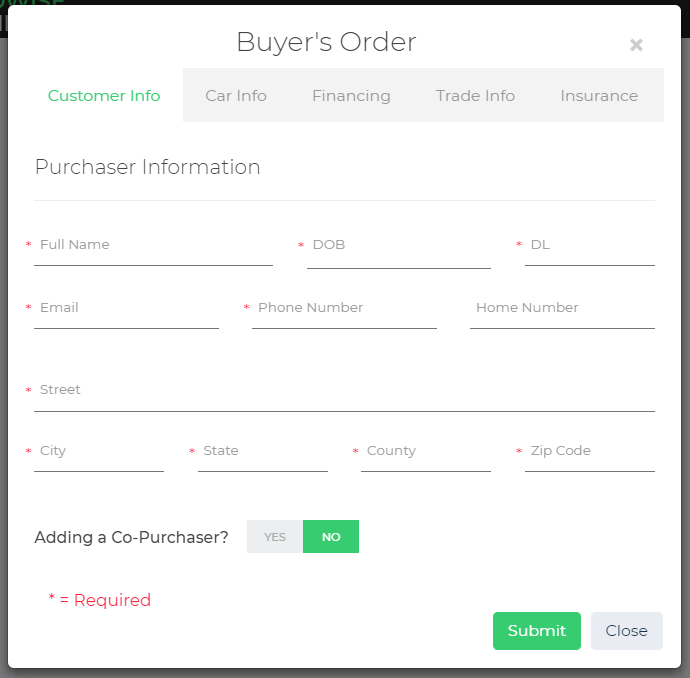

Modal that once completed, creates a loan in the system.

> Loans will be automatically assigned to customers **once a customer creates an account with EXACT full name (case and empty spaces included) and DOB of an EXISITING purchaser or copurchaser's name and DOB in a buyers order.** The Loan-User match does **not** take the customer's driver's license number into consideration, although this may easily be implemented in *loans.crud.js*.

#### Modifying Loans

If you're an admin, all Loans in the database can be accessed be seen once you login. When a loan *row* is click, it will expand and the picture above will appear. From there you can:
- Edit the original Buyer's Order with the _Buyer's Order_ button (although see note below about changing names or DOBs).
- Send a generic email to the purchaser and copurchaser *ONLY IF* their emails are listed on the buyer's order.
- Assign a warranty to this loan. After one is assigned, the grey section under "Warranty plan" will appear.
- Change the loan status

> Updates to the purchaser/copurchaser's name or DOB will **not** result on automatic updates to possible users. As mentioned above, this only happens at customer's account CREATION time. Modifying this will need some work (easy-medium difficulty).

#### Comments on Loans

Comments are created by clicking "Save comment", and they are shown reverse chronological order. Both customers and admins can save and see normal comments. 

Clicking on the "Visible to customer" button as an admin and then saving it will create comments that will only be visible to other admins, and not the customer(s).

Comment permissions are as follows:
- Customers can create but **cannot** delete comments
- Admins can only delete their **own** comments.
- Super admins can delete everyone's comments, except for System's.

#### Changing Loan Status
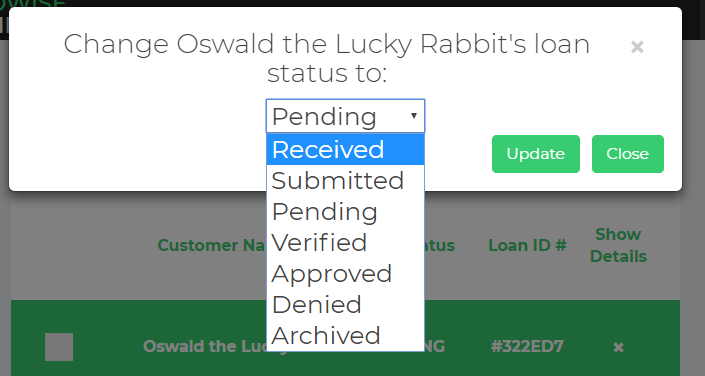

A Loan's status can be changed with the _Change Status_ button. The popup above will then later appear, and it'll prompt you to select one of the 7 Loan statuses:
- Received
- Submitted
- Pending
- Verified
- Approved
- Denied
- Archived

#### Warranties - Admins
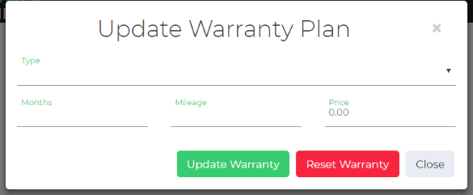

Clicking the _Change Warranty_ button opens this popup. Once submitted, and as long as the *price is _not_ zero*, the next show below will be added to the loan view in **both** admin and customer view. You can make the below section disappear from the loan by either the "Reset warranty" button.
  
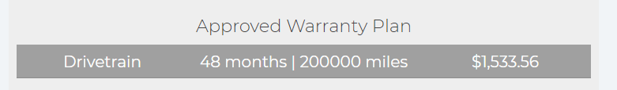

#### Email Updates
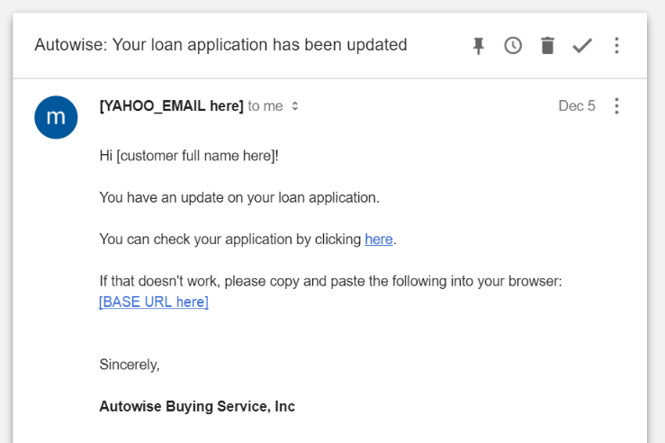

Clicking on the an orange _Email Customer(s)_ button will send the email above to the loan's purchaser and copurchaser *ONLY* if their emails are listed on the buyer's order with the respective fields filled.

#### Mass Loan Operations

You can 'mass' change status or remove loans. You first start by selecting them by checking the checkbox associated with them. Then, by hovering over the circular "+" button in the lower-right corner of the **admin view** the below buttons are revealed.

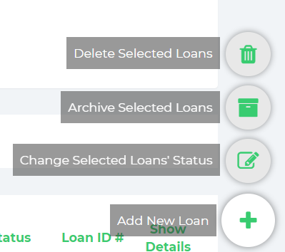

- The *pencil* button opens the change status popup as discussed in the Modifying Loans section. Confirming this popup will change all selected Loans to the status specified in the dropdown.
- The *box* button archives all selected Loans.
- The *trash* button (only visible to a _Super Admin_) deletes all selected Loans permanently.

### Warranties - Customers
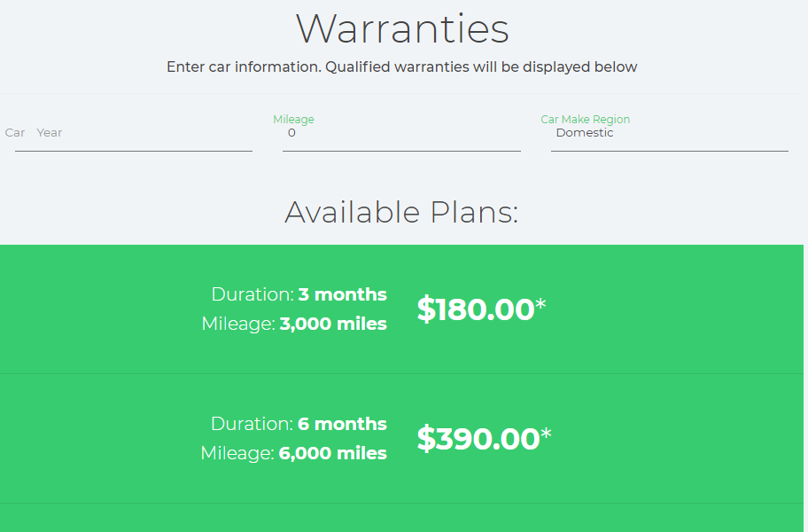

<!-- ABRIDGE!!! -->
A customer may request a warranty plan on a specific loan by clicking the _Request a warranty plan_ button near the top of the loan. This takes the customer to the **customer loan view**. In this area, the customer searches for a warranty plan of interest based on criteria of plan type and car age and make. Available warranty plans are automatically filtered below and a customer selects one they are interested in. Upon selecting, a popup appears listing the warranty plan details and a confirmation button. When the button is clicked, an email with the warranty plan details is sent to Autowise and a comment is added to the loan with the requested plan information.

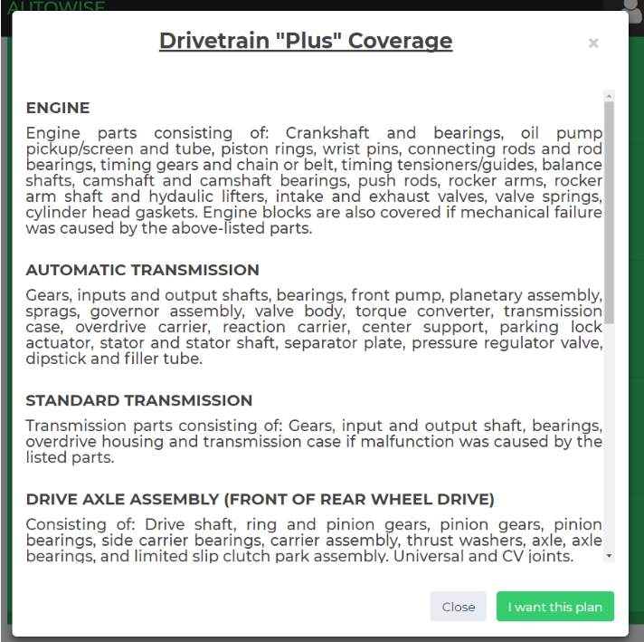

<!-- Once an admin reviews the plan, they may approve it by added a warranty plan to the specified loan, as described in the  -->

[Warranties-Admins](#warranties---admins) section.

#### Warranty Requests
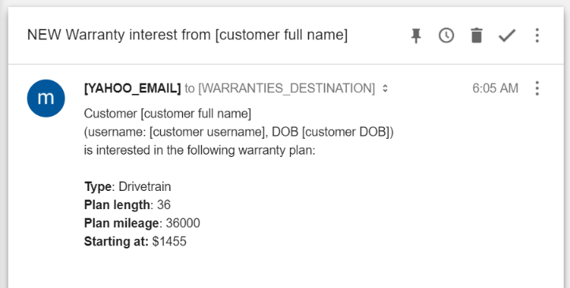

This is how an Warranty email request will look like, with the given [variables] filled out.

### User Management

#### User Creation and Types
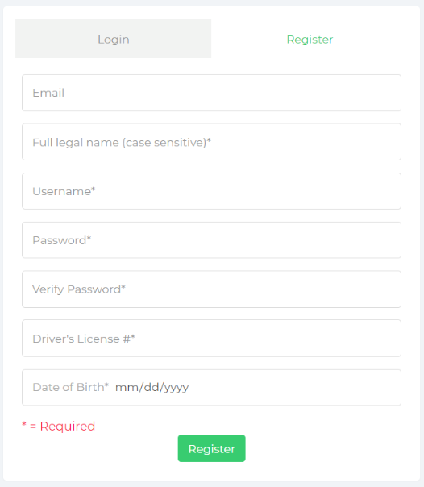

To create an account, a person must specify their name, a username, their DOB, and DL number (email is optional). The app does not have the ability to recover passwords, so _do not forget your password!_ (there's a workaround this. Click "Forgot username of password?" on the site for more information)

Everyone starts as a  _customer_ by default. Next sections describes how this can be changed.

#### User Permissions and Account Management

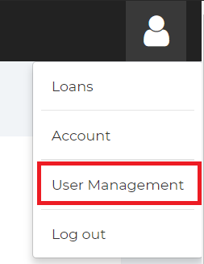

Super admins can change permissions by accessing the *permissions view* by clicking the "User Management" button as seen above.

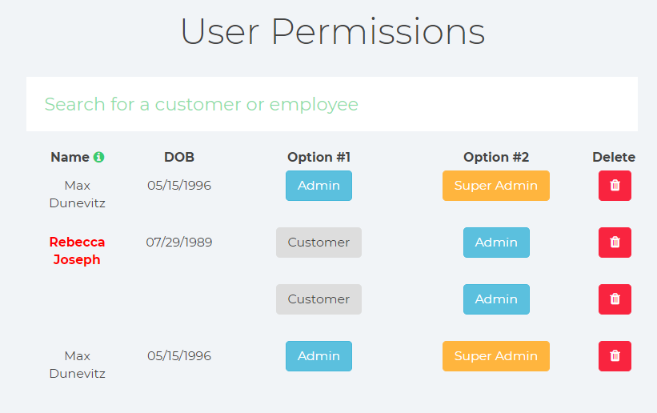

Here you can search for *any* existing user's values associated with their account (name, username, DOB, DL #). The type of user account can be inferred based on the styling of their name:
+ Customers
+ <b>Admins</b>
+ <b>Super admins</b> + *red text color*

A more colorful legend can also been seen by clicking the green "i" button next to the "Name" column header.

**Any** super admin can change **any** user account to a **any** of one the three types.

They can also delete **any** account, and never look back!

## Technical Details

### Project Dependencies
- [Node.js and npm](https://nodejs.org/en/download)
- [Heroku CLI](https://devcenter.heroku.com/articles/heroku-cli#download-and-install)
- [Python 3.x](https://www.python.org/downloads/) for automated tests

### Development
- Clone or Download
- Connect to Heroku
    + Run `heroku login` to authenticate into your Heroku account.
    + Connect to a app: `heroku git:remote -a [heroku app name]`
        * Gulp will **NOT** work if you don't do this (and by extension **NOTHING WILL**). There are ways around this once you acquire the environmental variables
    + For project duplication: You **MUST** be added as a collaborator on the project, and have specific Heroku config variables defined in order for this to work. These variables are referred in the backend code as `process.env.VARIABLE_NAME`, and the needed ones are listed [here](#modifying-variables)
- Installation and Execution
  + First run: `npm run first-install`
      * Make sure **NOT** to have the project tree open in an IDE/Text Edition (e.g. [Sublime Text 3](http://sublimetext.com), or any of other crappier alternative kids use these days). If issues persist after closing it try to run the command with admin privileges
  + Any other time: `gulp`. [Gulp](https://gulpjs.com/) provides automatic server and frontend restarts after local file changes
      * For a cleaner command line, it helps if you add the clearing command of your OS first, then command separator, and THEN `gulp`
        * Clearing: `cls` on Windows, `clear` on Unix
        * Separator: `;` or `&&`
- Deployments
  + Automatically
    * Can be set up on every push to any branch if you set up automatic deployment in Heroku
      - [Instructions](https://youtu.be/_tiecDrW6yY?t=179)
      - TL;DW: Heroku → App → Deploy tab → On 'Deployment method' select 'GitHub' → Connect to GiHub → Search your repo → 'Connect' → 'Automatic deploys' → 'Enable automatic deploys'
  + Manually
    * Once connected with Heroku's git (first two bullets of *Connect to Heroku* above) run `git push heroku master`
- Testing
  - First time: `npm run first-tests`
  - Later: `npm run tests`
  - Another command line will open when running these. It'll run gulp and selenium in parallel if they're not already. You **must** have gulp running for all tests, and selenium for the e2e ones to work. This extra command line takes care of it for you.

### Overall Comments & Implementation Tweaks
- To have modularity (since we started from scratch after all), we used [EJS](http://ejs.co/) as templating engine to allow for HTML code reuse, and overall better project organization. That being said, you MUST pass a `path` variable when rendering any of our files, since it's a reference to frontend dependencies. In the case of dynamic urls, `login_routes.validPath` takes care of figuring out the correct `path` given a Node `req(uest)`.
<!-- ALMOST DONE ~ -->
- We use a combination of a JWT token and a browser md5hash to authenticate users. The md5 hash is calculated from within *md5-device-fingerprint.js* ([Source](https://gist.github.com/splosch/eaacc83f245372ae98fe)) and can be accessed as `window.fingerprint.md5hash` inside any internal site. A JWT must be valid (i.e. not expired), and the md5 hash from the calling browser must be the same as the one the JWT was created with in order to correctly authenticate. This prohibits users from accessing other users account by copying and pasting links in different computers (or even 'Safe Browsing'/Incognito modes).
  - An improvement to this would be to pass the tokens internally as state variables, but we didn't implement frontend routing.
- Frontend:
  - We implemented Material Design in pure CSS (i.e. no dependencies)
  - There's two main Monoliths:
    * `Factory.js`: contains all API calls used throughout all the controllers
    * `modals.ejs`: has all the modals used (except for the Buyer's Order).
- Sometimes to circumvent Node/JavaScript's asynchronous nature, logic is placed inside `if`s to force precedence/synchronism.

<!-- 
  @Max: check if you can put this somewhere else in the app functionality. Gotta AT LEAST STRESS Material design somewhere.
  - Checkbox to search query functionality
  - Material design floating (& hidden) menu button(s)
  - Selection/checkbox for mass data manipulation (mass update, delete, archive, etc.)
  - Material design inputs and drop down selectors
 -->

### Testing
Two classes of tests are developed: backend and end-to-end tests. A total of 4 tests are provided and are described below (3 backend and 1 end-to-end).

All tests can be run automatically with the command `npm run tests` as previously described [here](#development) on the Testing bullet.

The 3 backend tests (located at *unit_testing/mocha*) can be run individually with  `mocha [filename]`. Remember to have gulp running in parallel.

The end-to-end can be found in _unit_testing/protractor_, and can be run individually with `protractor unit_testing/protractor/protractor.config.js`. Remember to have gulp + selenium running in parallel.

### Project Structure
The following details the folder structure of the application and the purposes of each file. File names are _italicized_

- _.env:_ Sensitive environment variables hosted in Heroku (present in compiled project, not on Git repo)
- _Procfile:_ Heroku installation instructions
- _gulpfile.js:_ Gulp settings. Automatic server and browser reload on local file changes
- _server.js:_ top-level file that starts the server and runs the application
- _package.json:_ Details Node.js dependencies that will be downloaded under 'node_modules'
- _package-lock.json:_ Extension of above *package.json*
- _README.md:_ Open it and find out
- _test.py:_ Automated testing logic
- client: files and scripts run or viewed on the client (user) side
  + angular: Angular code driving customer views
    * _account.controller.js:_ drives functionality of the user info view
    * _admin.controller.js:_ drives functionality of the admin loan database view
    * _app.js:_ registers the module app which all controllers belong to
    * _controller-template.js:_ template file for additional controllers
    * _customer.controller.js:_ drives functionality of the customer loan view
    * _custom-filters.js:_ drives functionality of the admin loan filtering
    * _factory.js:_ handles requests from the client to the server and back. Methods defined here are used in nearly every controller
    * _login.controller.js:_ drives functionality of the login and registration view
    * _nav.controller.js:_ drives functionality of website navigation
    * _permissions.controller.js:_ drives functionality of the super admin edit account permissions view
    * _warranties.controller.js:_ drives functionality of the customer warranties request view
  + css: CSS styles
    * _styles.css_: Main CSS file
    * _accord.css_ & _component.css_: Other CSS files
  + fonts: fonts used by CSS files, primarily called from _component.css_
  + dependencies: Angular JavaScript source
  + js: additional JavaScript dependences
    + _md5-device-fingerprint.js:_ Priorly explained external dependency used with for custom token-based authentication.
  + partials: smaller chunks of HTML content later incorporated into main views
    * _header.ejs:_ Global HTML `<head>` content
    * _footer.ejs:_ Global JavaScript dependencies
    * _nav.ejs:_ Navigation bar atop each page
    * _accordion-comments.ejs:_ HTML for loan content and comments functionality
    * _actions-row.ejs:_ action buttons appearing under the header of a loan visible to admins
    * _admin-filters.ejs:_ admin loan filtering and search bar
    * _buyers-order.ejs:_ popup displaying the Buyer's Order
    * _google_buttons.ejs:_ admin loan hover create/edit/delete buttons
    * _modals.ejs:_ various modals/popups/dialogs
    * _progress-row.ejs:_ unused now?? -> will be used for customer view
    * _warranty-row.ejs:_ the warranty plan on a loan under the loan header
  + resources: images and other miscellaneous files
  + _account.ejs:_ user account information view 
  + _admin.ejs:_ admin loan database view (also referred to as the **admin view**)
  + _customer.ejs:_ customer loan view (also referred to as the **customer view**)
  + _login.ejs:_ login and register view
  + _permissions.ejs:_ super admin account management view
  + _warranties.ejs:_ customer warranty plan request view
- documentation: resources used in this document
- node_modules: Imported required Node modules. Don't mess with this folder (present in compiled project, not on Git repo).
- server: files and scripts run on the server side
  + db: files defining database objects and server-side database operations
    * _loans.crud.js:_ details CRUD operations on Loan database objects
    * _loans.model.js:_ defines the Loan database schema and several server side Loan operations
    * _users.crud.js:_ details CRUD operations on User database objects
    * _users.model.js:_ defines the User database schema and several server side User operations
  + _api_routes.js:_ defines routing for API requests including loan and user management
  + _app.js:_ server side application initialization, called from 'server.js' at the top-level directory
  + _auth.js:_ provides authentication functionality
  + _emailing.js:_ provides emailing functionality
  + _express.js:_ defines top-level routing which is further detailed by one of the other routing files
  + _login_routes.js:_ defines routing for user login and registration requests
  + _profile_routes.js:_ defines routing for "logged-in" pages, such as the user account info view
- unit_testing: files and scripts used in app testing

### Heroku

#### Accessing Variables

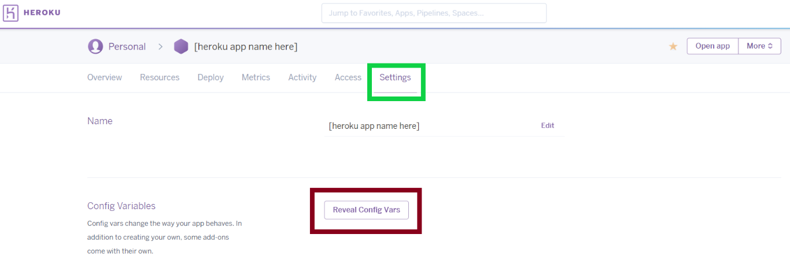

You get to your sensitive variables thru the 'Settings' Tab, then by clicking 'Reveal Config Vars'

#### Modifying Variables

Here you can edit/remove values which are sensitive, and that shouldn't be stored publicly. The established environment variables are follows:
<!-- https://github.com/zeit/ms#examples -->

- **BASE_URL**: Heroku or bought domain name website where the main app is browsable from. Used in automated emails as links to site.
  - Currently reroutes views to HTTPS since Heroku has by default FREE SSL/HTTPS. No need to spend the extra $$$$ to pay for it.
- **WARRANTIES_DESTINATION**: Email where the Warranty requests emails will be sent to. Allows for more flexibility (and less spam) on emails if you desire to use a different from the one sending automated emails.
- **MAX_SESSION_TIME**: Max amount of time **any** user is allowed to stay on the site without logging in again. The format of this fields needs to be like [this](https://github.com/zeit/ms#examples)
- **MONGODB_URI**: Database access link (user sensitive). Provided from Heroku Add-On. This can be changed to any valid MongoDB DB (eg. localhost or etc).
- For automated emails (further instructions [here](#emailing-variables))
  + If using a Yahoo account: **YAHOO_USERNAME** and **YAHOO_PASSWORD**
  + If using a Gmail account: **GMAIL_USERNAME**, **CLIENT_ID**, and you'd need to add **GMAIL_PASSWORD** (_**real password**_). 
      - I'd recommend you to **at least** b64-encode your password since you will have to store it in plain text (`atob` and `btoa` node packages do this in the backend for you).
      - Currently using the Yahoo settings, so you'd have to flip the comments if you'd like to switch over to Gmail.

### Emailing Variables
> TBFinished

#### Yahoo
Account Security => Two-step => New App => Other App
Maybe also: Allow less-secure apps

#### Gmail
Get a Gmail API key, adjust valid urls
